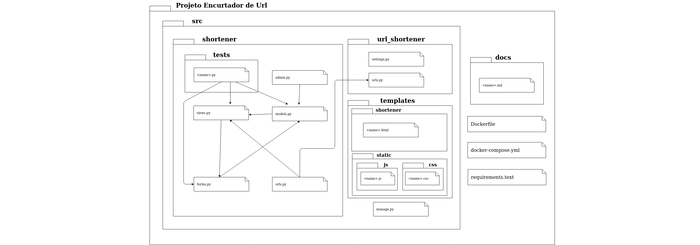

# Documento de arquitetura

## 1.Introdução

### 1.1 Objetivo

Este documento oferece uma visão geral arquitetural do sistema que será implementado, permitindo assim que os envolvidos no projeto conheçam como a aplicação será subdivida.

### 1.2 Escopo

Este documento tem como foco o projeto "Encurtamento de URL", que é uma técnica utilizada na internet para transformar um endereço HTTP em um link mais curto.

## 2. Representação arquitetural

### 2.1 Django 

O Django é um framework web de alto nivel criado com a linguagem Python, com o objetivo de ter um rapido e limpo desenvolvimento, que utiliza o padrão model-template-view. Esse modelo MTV é baseado no modelo Model-View-Controler, com a diferença que as responsabilidades do módulo de Controller está dispersa no próprio Framework.

Outro motivo para a escolha do Django é a sua potência. O framework possui diversos módulos embutidos que aumenta a produtividade no decorrer do projeto. Dois importantes módulos podem ser citados:
- Mapeador objeto-relacional (OMR) que irá facilitará a utilização do SQL.
- O painel administrativo que irá de forma visual criar, deletar, editar e visualizar objetos do banco de dados.

#### 2.1.1 Modelo MVT

A **Model** é a camada de acesso dos dados. Nessa camada contém as classes que abstraem os dados, as lógicas de validação, de filtro e de acesso.

O **View** é a camada das regras de negócios. Nessa camada será implementada as restrições, o que um usuário pode ou não pode fazer, e quais páginas eles têm acesso. É através dessa camada que as requisições do usuário serão gerenciadas.

Essa camada implementa algumas funções do Controller do padrão MVC, porém o MTV se diferencia de MVC por ser mais permissivo quanto a comunicação entre diferentes partes do software.

O **Template** é a camada de apresentação. Os templates são arquivos de texto, que isola os dados do sistema da forma como esses dados serão apresentados. O formato mais comum é o HTML.

## 3. Metas e restrições arquiteturais

#### 3.1 Suportabilidade

A aplicação poderá ser utilizada nos principais navegadores modernos. Ela será desenvolvida tanto para Desktop, quanto para Mobile (Web responsivo).

### 3.2 Usabilidade

O sistema deverá ser objetivo e intuitivo, de forma que a aplicação não tenha nenhum empecilho de ser utiliza.

### 3.3 Ferramentas de desenvolvimento

O projeto será desenvolvido em Python, utilizando o framework Django, em conjunto com o Javascript. Por fim a aplicação será um monolítico.

Para facilitar na portabilidade da plataforma, será utilizado o Docker para realizar o empacotamento da aplicação.

### 3.4 Confiabilidade

O sistema terá uma cobertura mínima de testes de 90%, buscando garantir que suas funcionalidades foram suficientestestadas.

## 4. História de usuário

1. Primeira história: Como usuário, desejo encurtar urls para tornar os links da minha plataforma mais agradáveis ao serem compartilhados para outros usuários;
2. Segunda história: Como usuário, desejo visualizar as urls mais acessadas após o encurtamento, para validar se urls encurtadas são mais acessadas após o seu compartilhamento do que as originais;

### 4.1 Critérios de aceitação 

1. Primeira história:
    - O input deve validar se o texto inserido tem o formato de uma url;
    - Urls inválidas não poderão ser encurtadas;
    - Urls encurtadas devem ser únicas;

2. Segunda história:
    - O ranking deve mostrar apenas as 5 urls mais acessadas;
    - O ranking deve mostrar a url original, a url encurtada e a totalidade de acessos a essa url encurtada;

## 5. Diagrama de pacotes

